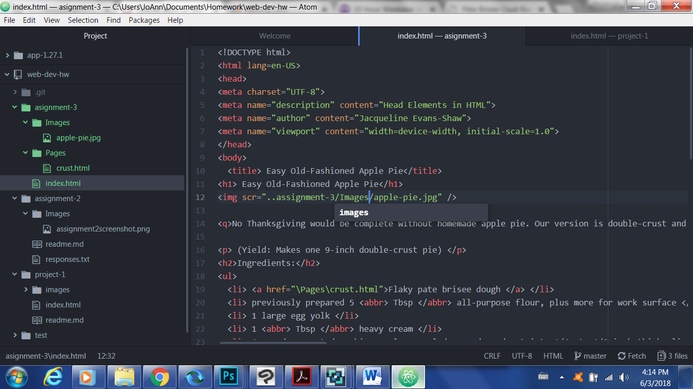

# Assignment 3 Technical Report

A head should have 5 elements, those being the meta, viewport, title, link, and style.
Each of these differentiate the content, author details, how the page is viewed, and
what the document is called. The body should have structural markup and semantic markup
elements.

Structural markup identifies information regarding the structure of the document;
semantic markup defines the meaning of said information.

My work cycle was long and tedious; I experienced some issues embedding my image in the text,
but I believe this was resolved. I learned how to embed nested lists, which I always was curious
how to do.

