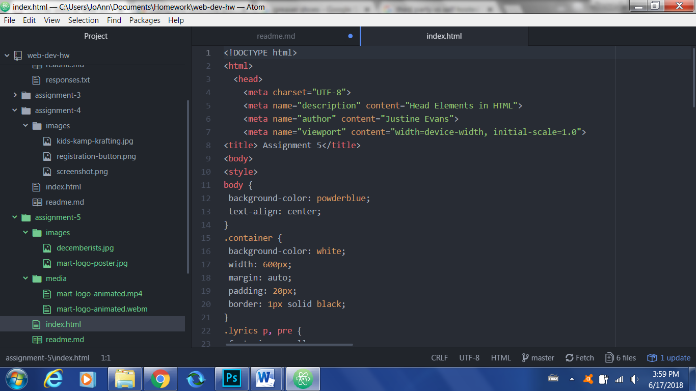

# Assignment 5 Technical Report
Divs are building blocks that group content together; spans exist within divs, and although they do not created building blocks, they organize content that requires extra styling; classes identifies HTML elements using the same unique name value; the id attribute gives a unique identifier to every specific element.

Third party websites make uploading and embedding content particularly easy, since they supply the html code within the given link; self-hosted techniques require coding skills (of course) but are also prone to errors and could take up more bandwidth than necessary if done incorrectly.

I simply followed the given instructions for this assignment, and encountered really no problems or setbacks.

