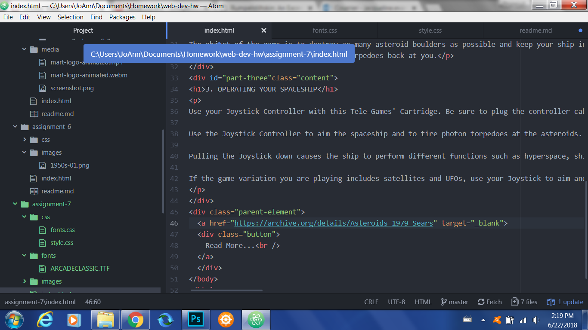

# Assignment 7 Technical Report

I chose the Arcade Classic and Nova Square fonts for this assignment because they fit the theme of "gaming" with the Ataria manual perfectly.

System fonts are already installed on your local device/system; web fonts are custom fonts hosted on a different server; web-safe fonts are ones that client computers are likely to already have (such as comic sans, Georgia, etc). Having fallback fonts allows a client computer to still download the text so it is readable, even if the server doesn't have the intended font installed.

My process was smooth and straightforward with this assignment, which I completed by following the given instructions.

