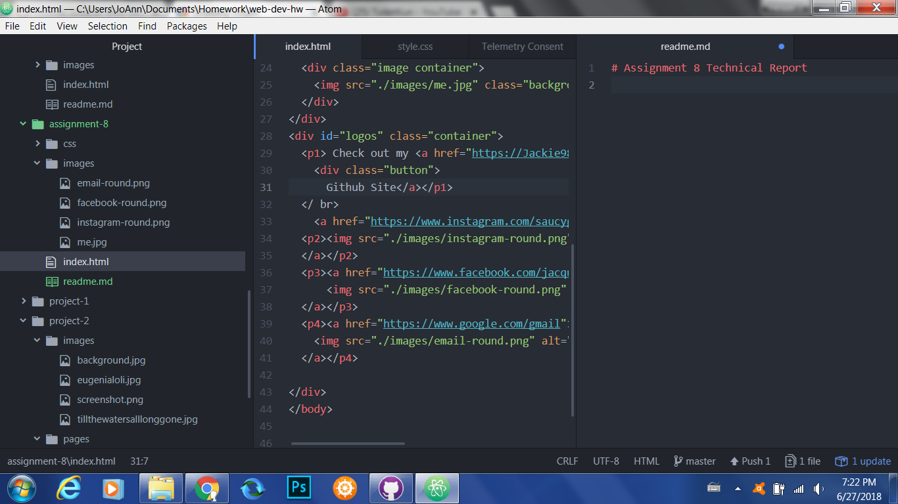

# Assignment 8 Technical Report
A border separates content with a visible line or box; padding is the amount of space between the inner content and the element; margin is space between the box, the element within it, and other elements around these.
The hardest part of this assignment for me was getting my elements of overlap with the z-index.
My work process for this was to follow the directions as listed and solve my difficulties using the tutorials in the website.

