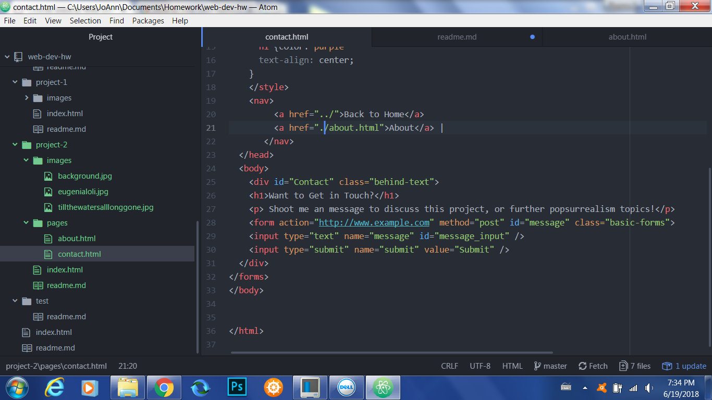

# Project 2 Technical Report
My experience with HTML was tedious but overall satisfying. It was a long, laborious process, but the time put into coding all my webpages and assignments paid off in seeing what I code produced with just a few symbols and words.

I am excited to learn what exactly CSS is.

My work cycle with this assignment was standard; any errors or difficulties I faced, I remedied by referring to the website (particularly with designing the navigation links).

